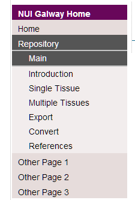
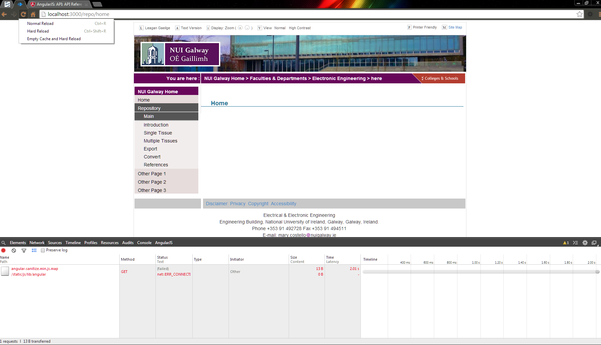

<<<<<<< HEAD
Running the Website
===================

1.	First install the Node Package Manager
		for Windows: [Nodejs Website](http://nodejs.org/)
		for Linux `sudo apt-get install nodejs` (or whatever package manager you prefer)

2.	Download this repository via GitHub
		(If you need to install Git first see these [instructions](http://git-scm.com/book/en/Getting-Started-Installing-Git)

3. To run you will need to either install both MongoDB and MySQL and have them running or comment out some lines of code in the `server.js` file.
	
3.1 _Remove Lines:_
		Comment out the lines from 55-67 (instructions on this are in the code too incase the line numbers change)
		
3.2 _Adding DBs_
		TODO : add these instructions

4.	Open a terminal and move into the git repo directory
		Run `npm install`
		Then `node server.js` and you should be able to open `localhost:3000` in a browser.

Creating Pages on the repository
================================

1. Add the new page to the nav menu:

=======
fyp
===

1.	This corresponds to the `$scope.menu` object in the __NavCtrl.js__ (static/js/controllers/NavCtrl.js)
		To create a new single page simply follow this format:
			{name:"Other Page 2", link: "/other2",subMenu:[]}

2.	Then add it to the AngularJS Router in __app.js__ (static/js/app.js) :
			config(function ($routeProvider, $locationProvider) {
	  		$routeProvider.
	  		.
	  		.
	  		.
	  		when('/other2', {
	      templateUrl: '/views/partials/other2.html',,
	      title: "Other Page 3"
	    }).

Here `title` refers to the text which appears in the Browser's tab and `templateUrl` is the html template which will be loaded into the layout by Angularjs.

If you want to have sub pages, simply base the menu options and routes of the `repo` settings.

3.	Now create the actual page. Create the html file in the directory specified in the router above. This page doesn't require `<html>`, `<head>` or `<body>` tags, simply begin creating content. If you want to include some logic also create a ctrl file in static/js/controllers :

			angular.module('app.controllers').controller('OtherCtrl', function ($scope) {
				.
				.
				.
				.
			});

  and include it in the html template using `ng-controller` in the top level element:

		

			.
			.
			.
			.
		

		Now you can use AngularJS to manipulate the DOM, see the [docs](http://docs.angularjs.org/api) for details.

4. Testing: when testing the new pages you don't need to restart the server but it would be advised to clear the browser cache. Use Google's Chrome browser, open the developer console using F12, click on the settings icon(a gear) in the top left corner of the dev tools. Under general settings tick 'Disable cache (while DevTools is open)'.
Now while the dev tools are open you can right click the Refresh icon in the top right of the browser and select 'Empty Cache and Hard Reload'

